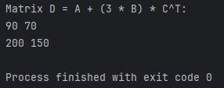

# Matrix Library Project (C and C++)

## AUTHORING
- **Name:** Michael Greene
- **Class:** CMSC 313 - Spring 2025 - Mo/We - 10:00-11:15am
- **Date:** April 18, 2025

## PURPOSE OF SOFTWARE
This project implements a matrix manipulation library in both **C++** and **C**. The library supports basic matrix operations such as:
- Matrix addition
- Scalar multiplication
- Matrix multiplication
- Matrix transpose

## FILES

### C++ Version
- `C++matrix.cpp` — C++ implementation of the `Matrix` class
- `C++matrix.h` — Header file for the C++ Matrix class
- `C++main.cpp` — Test program that performs the matrix operation `D = A + (3 * B) * C^T`

### C Version
- `Cmatrix.c` — C implementation of the matrix functions using a `struct Matrix`
- `Cmatrix.h` — Header file for the C Matrix functions and struct
- `Cmain.c` — Test program for the same matrix operation using the C functions

### Shared
- `CMakeLists.txt` — CMake build file for both C and C++ versions

## BUILD INSTRUCTIONS

### Using CLion
It will automatically detect the CMakeLists.txt and provide executables for both C++ and C versions of main

### Using Terminal (x86 Linux/GCC)
```bash
# For C++
g++ -std=c++14 C++matrix.cpp C++main.cpp -o matrix_cpp

# For C
gcc -std=c99 Cmatrix.c Cmain.c -o matrix_c
```

## Expected Output
